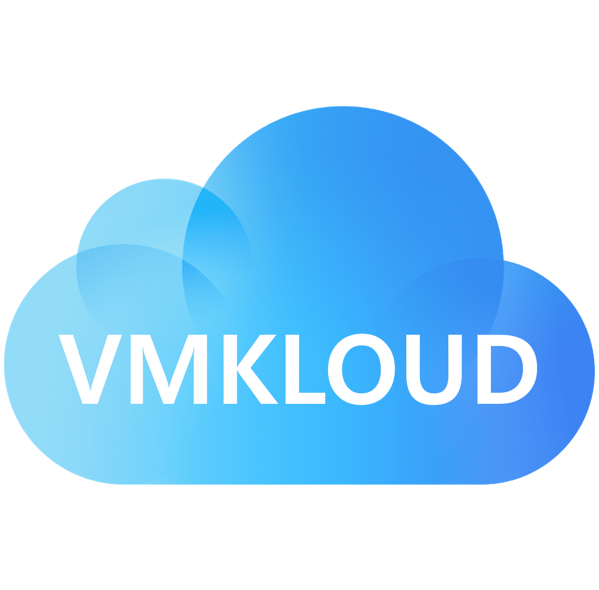

# vRealize

This is a vRealize repository for successful cloud builders

Powered By "VMKloud" / "VMware"

## Guide

### For Demo and Lab

Contact to Hye-Churn Jang (jangh <at> vmware.com), If you want to use the VMKloud lab

 - <a href="./docs/guide/korean/README.md">한국어</a>
 - <a href="./docs/guide/english/README.md">English</a>

### Cloud Builder

Coming Soon

 
## Assets

### For vRealize Automation

#### VM Template Build

 - **settings/images/centos8** : Sample scripts for making vRA vm template by CentOS 8
 - **settings/images/ubuntu18** : Sample scripts for making vRA vm template by Ubuntu 18.04
 - **settings/images/ubuntu18** : Sample scripts for making vRA vm template by Ubuntu 20.04
 
#### Advanced Workflows

 - **settings/orchestrator/com.vmk.package** : Advanced vRO workflows for well-known tasks

#### Cloud Templates

 - **templates/blueprints/* ** : Cloud Assembly blueprints and Service Broker custom forms
 - **templates/terraforms/* ** : Terraform templates

### For vRealize Operations

Coming Soon

### For vRealize Log Insight

Coming Soon
