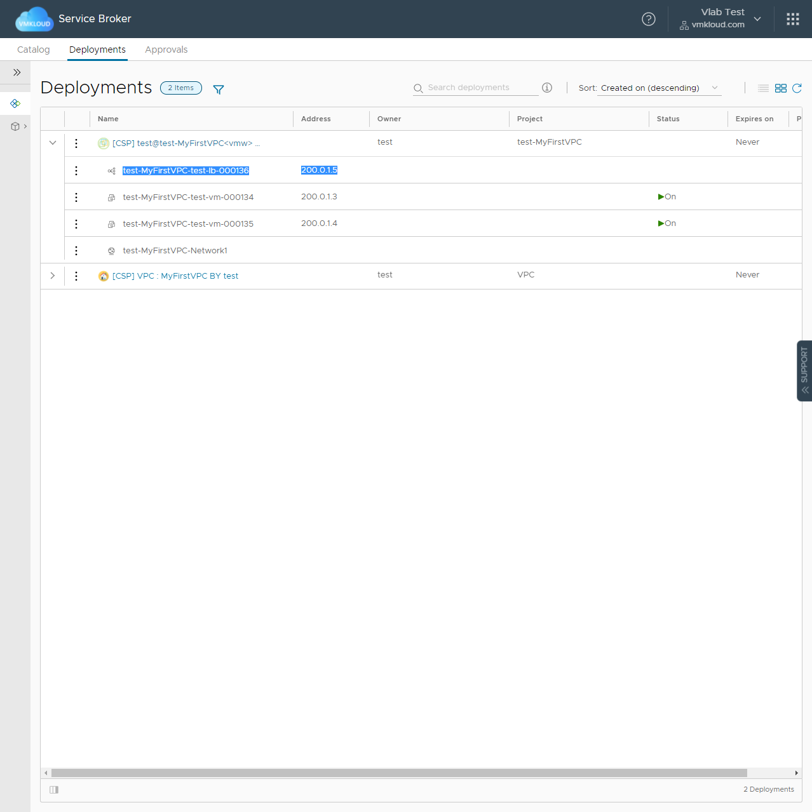

# vRealize 데모 및 테스트 환경

## 1. 데모 환경

### 1.1. 권한
 - vRealize Automation을 통한 개인 VPC 생성 및 제공되는 카탈로그 배포 삭제 권한 제공
 - 모든 제품 및 기능에 대한 Read Only 권한 제공

### 1.2. 접속 가능한 테스트 환경 구성

 - <a href="https://my.vmkloud.com">https://my.vmkloud.com</a> : Workspace One VMKloud 포탈 (SSO 지원)
 - <a href="https://vcsa.vmkloud.com">https://vcsa.vmkloud.com</a> : vCenter
 - <a href="https://nsxt.vmkloud.com">https://nsxt.vmkloud.com</a> : NSX-T Manager (SSO 지원)
 - <a href="https://vra.vmkloud.com">https://vra.vmkloud.com</a> : vRealize Automation (SSO 지원)
 - <a href="https://vrops.vmkloud.com">https://vrops.vmkloud.com</a> : vRealize Operations (SSO 지원)
 - <a href="https://vrli.vmkloud.com">https://vrli.vmkloud.com</a> : vRealize Log Insight (SSO 지원)

### 1.3. SSO Login

 

<a href="https://my.vmkloud.com">https://my.vmkloud.com</a>

### 1.4. 데모 수행

#### 1.4.1. vRealize Automation 접속

<a href="https://vra.vmkloud.com">VMKloud vRA</a>로 접속합니다. 
사용가능한 계정을 이용하여 로그인 합니다.
 
#### 1.4.2. Service Broker에서 카탈로그 확인

 

기본 데모로 이용 가능한 모듈은 Service Broker (Self-Service Portal) 만 제공합니다. 
최초 사용 가능한 카탈로그는 VPC만 가능합니다. 
개인 용도의 VPC를 만들어야 추가적으로 사용 가능한 카탈로그들이 노출됩니다.

#### 1.4.3. VPC 카탈로그 요청

  

 - Name : 생성할 VPC 이름을 입력합니다. (영어만 가능하며, 특수문자 및 띄어쓰기 불가능합니다)
 - Network Type : Private Route는 SNAT로 구성된 네트워크를 생성합니다. Global Route는 전역 통신이 가능한 네트워크를 생성합니다. 데모에서는 Global Route로 생성합니다.
 - Networks : 생성할 네트워크의 이름을 지정합니다. Private Route의 경우 서브넷 CIDR도 지정합니다. 최대 5개의 네트워크를 생성 가능하며, 데모에서는 1~3개 정도에서 원하는 네트워크를 생성합니다.
 - Load Balancer : 현재 VPC에서 Load Balancer를 사용할 것이라면 체크 합니다. 데모에서는 Check 합니다.

VPC 생성과정을 확인하고 싶다면 <a href="https://nsxt.vmkloud.com">NSX-T Manager</a>로 이동하여 네트워크 상테를 확인합니다.

#### 1.4.4. VPC 생성 후 사용 가능한 카탈로그 확인

VPC가 활성화 되면, 추가적인 카탈로그 이용이 가능합니다. 
카탈로그의 Request 버튼이 활성화 되지 않는다면 웹브라우저의 "페이지 새로고침"을 통해 화면을 갱신합니다. 
카탈로그가 RBAC기능과 엮여 정상적으로 Request 권한이 활성화 되기까지는 조금의 시간이 필요합니다.

#### 1.4.5. 셀프 서비스 VM 배포 (단순 VM 및 어플리케이션 서비스 배포)

단순 VM 배포 데모를 수행합니다. 
배포할 VM의 형상은, VM 두대에 Apache2 웹 서버를 설치 한 후 간단한 메시지를 출력하는 것입니다. 
또한 VM 앞에 Round Robin 형식의 Load Balancer를 추가하여 Load Balancer를 통해 접속하는 웹 트래픽의 변화를 살펴볼 것입니다.

VM의 기본적인 설정을 진행합니다.
 - Project : 이용 가능한 Project(VPC)가 자동 활성화 됩니다. 여러 VPC가 있다면 원하는 Project를 선택하면 됩니다.
 - Cloud Zone : Project를 선택하면 자동으로 이용 가능한 Cloud Zone이 활성화 됩니다. 여러 Cloud Zone이 있다면 원하는 Cloud Zone을 선택하면 됩니다.
 - Compute : Cloud Zone에서 선택 가능한 VM 배포 위치를 지정 할 수 있습니다. 데모에서는 CL-WORK-01/RP-ZONE-01을 선택합니다.
 - Flavor : 배포할 VM의 크기를 결정합니다. 데모에서는 medium (2Core 4GRam)을 선택합니다.
 - VMs : 배포할 VM의 수를 결정합니다. 2개 이상일 경우 VM의 직접적인 IP 지정이 불가합니다. 데모에서는 2개를 선택합니다.
 - Networks : VM에 연결할 네트워크의 개수를 선택합니다. 데모에서는 1개를 선택합니다.
 - Network Functions : 추가적인 네트워크 기능을 사용 여부를 체크합니다. 데모에서는 체크를 활성화 합니다. Network Functions 탭이 활성화 됩니다.
 - Disks : VM에 생성할 추가 디스크를 입력합니다. 최대 3개의 디스크를 생성 할 수 있습니다.
 - Image : VM에서 실행될 OS Image를 선택합니다. 데모에서는 ubuntu20을 선택합니다.
 - Applications : 추가적인 어플리케이션 작업에 대한 여부를 체크합니다. 데모에서는 체크를 활성화 합니다. Applications 탭이 활성화 됩니다.
 - Username : VM에 생성할 접속 계정을 설정합니다. 자동으로 vRA에 로그인 한 계정으로 설정되어 있습니다.
 - Password : 생성할 계정에 부여할 암호를 설정합니다.
 - Password Confirm : 암호를 확인합니다.

바로 "Submit" 버튼을 누르지 않고 Network Functions 탭으로 이동합니다.

 

추가적인 네트워크의 기능을 설정합니다. 데모에서는 Load Balancer와 관련된 설정을 진행합니다. Load Balancer에서 "+" 버튼을 눌러 Virtual Server를 지정합니다.
 - Front End Port : 80
 - Front End Protocol : HTTP
 - Algorithm : ROUND_ROBIN
 - Back End Port : 80
 - Back End Protocol : HTTP
 - Health Check Port : 80
 - Health Check URL : /index.html
 - Health Check Protocol : HTTP
 - Timeout Seconds : 5
 - Interval Seconds : 5
 - Healthy Threshold : 3
 - Unhealthy Threshold : 3

HTTP(80)으로 들어오는 트래픽에 대하여 풀 멤버에 대해 HTTP(80)로 Round Robin 부하 분산을 합니다. 
이 떄 풀 멤버의 index.html 경로의 상태를 체크하여 Load Balancing 연결을 수행합니다. 
Network Functions 설정을 완료 후 바로 "Submit" 버튼을 누르지 않고 Applications 탭으로 이동합니다.

VM에서 수행될 소프트웨어 설정을 진행합니다.

 - Package Update : Repository 인덱스를 업데이트를 할지 여부를 체크합니다. 데모에서는 체크를 활성화 홥니다.
 - Package Upgrade : 설치되어 있는 Package에 대한 Upgrade를 수행 할지 체크합니다. 데모에서는 체크를 활성화 합니다.
 - Packages : 설치할 패키지 목록을 입력합니다. 데모에서는 apache2를 입력합니다.
 - Boot Scripts : 패키지 설치 후 작업할 내용을 입력합니다. 데모에서는 아래와 같은 내용을 입력합니다.
 
	echo "$(hostname)" > /var/www/html/index.html
	systemctl restart apache2

아래 입력 값들은 추가적으로 어플리케이션 라이프사이클로 관리할 스크립트 내용을 입력합니다. 데모에서는 사용하지 않습니다.

 - Install Scripts : VM 최초 배포시 수행할 스크립트를 입력합니다.
 - Configure Scripts : VM 최초 배포시와 VM 업그레이드시 수행할 스크립트를 입력합니다.
 - Destroy Scripts : VM 삭제시 수행할 스크립트를 입력합니다.

모든 값들이 입력된다면 마지막 확인을 한 뒤 "Submit" 버튼을 눌러 배포를 시작합니다.

 

배포가 완료되면 Successful 메시지를 확인 할 수 있습니다.

 

정상 동작 테스트를 위해 배포한 Load Balancer의 Virtual Server IP로 접속을 합니다. 
Virtual Server IP는 배포 결과에서 확인 가능합니다. 
데모 환경은 VMKloud의 내부 네트워크 환경이기 때문에 인터넷에서 직접 접근은 불가합니다. 
하지만 vmkloud.com 인프라의 L7 Proxy에서 다음과 같은 규칙으로 트래픽을 프록시 하고 있습니다. 

	예제
	내부 접속 URL = http://1.2.3.4:80
	Protocol = http
	IP = 1.2.3.4
		A = 1
		B = 2
		C = 3
		D = 4
	Port = 80
	=> https://${Protocol}-${A}-${B}-${C}-${D}-${Port}.vmkloud.com
	=> https://http-1-2-3-4-80.vmkloud.com

화면을 갱신하며 LB가 정상적으로 동작하는지 확인합니다.

#### 1.4.6. Kubernetes 배포 (Kubernetes 클러스터 배포 및 등록)

#### 1.4.7. Wordpress 배포 (멀티 티어 어플리케이션 및 LB 배포)

#### 1.4.8. SockShop 배포 (Container 어플리케이션 배포)

## 2. 랩 환경

### 2.1. 권한

#### 2.1.1. vCenter

<table>
<tr>
<th>Compute</th>
<td>

</td>
<td>

**사용가능한 리소스**
 - CL-WORK-01 / RP-TEST : 일반적인 테스트 용도
 - CL-WORK-01 / RP-VLAB-01 : 랩 테스트용 1번 Availability Zone
 - CL-WORK-02 / RP-VLAB-02 : 랩 테스트용 2번 Availability Zone
</td>
</tr>
<tr>
<th>Folder</th>
<td>

</td>
<td>

**사용가능한 리소스**
 - FL-TEMP : 이미지 읽기 권한만 가능
 - FL-TEST : 일반적인 테스트용 폴더
 - FL-VLAB : 랩 테스트용 폴더

**VM 템플릿**

FL-TEMP 하위에 있는 "TEMP-CENTOS-8", "TEMP-UBUNTU-18", "TEMP-UBUNTU-20" 사용 가능
</td>
</tr>
<tr>
<th>Storage</th>
<td>

</td>
<td>

**사용가능한 리소스**
 - DS-SHARE : OS 이미지와 같은 데이터 읽기 권한만 가능
 - DS-VMKLOUD : VM 배포용 데이터스토어
</td>
</tr>
<tr>
<th>Network</th>
<td>

</td>
<td>

**사용가능한 리소스**
 - SW-UNDERLAY / NET-V102-SVC-DHCP : DHCP 기반 네트워크, VM이 DHCP 설정이 되어 있다면 자동으로 IP 할당
 - SW-UNDERLAY / NET-V103-SVC-STATIC : STATIC IP 네트워크, VM 배포 후 네트워크와 충돌하지 않는 IP 직접 설정
</td>
</tr>
</table>

#### 2.1.2. NSX-T

권한 제공하지 않음

#### 2.1.3. vRealize 제품군

**전체 권한 제공**

**"DO NOT FIX !!!" 표시가 있거나 기본 세팅과 관련된 내용은 적대 수정 금지**

**vRealize Automation에서 수행한 Deployment 항목은 매일 오전 5시에 삭제함**